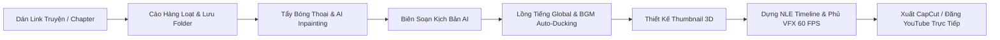

# 🎬 TunaMagaRecap - Manga Studio AI Native OS

<div align="center">


**Hệ sinh thái tự động hóa sản xuất Video Tóm Tắt Truyện Tranh (Manga/Manhwa/Manhua Recap) chuẩn YouTube & TikTok triệu view chỉ với 1-Click.**

[Tính Năng Pro](#-tính-năng-nổi-bật) • [Cài Đặt](#-hướng-dẫn-cài-đặt--khởi-chạy) • [Quy Trình Sản Xuất](#-quy-trình-sản-xuất-video-tự-động) • [Xuất Dữ Liệu](#-các-định-dạng-xuất-dữ-liệu) • [Tech Stack](#-công-nghệ-sử-dụng)

</div>

---

## 🌟 Giới Thiệu Dự Án

**TunaMagaRecap** là một Native Studio AI thế hệ mới được thiết kế chuyên biệt cho các nhà sáng tạo nội dung YouTube Manga Recap và TikTok Review. Chỉ từ một liên kết bộ truyện hoặc chapter bất kỳ, hệ thống sẽ tự động hóa toàn bộ các bước từ cào ảnh hàng loạt cả bộ truyện, phân tách khung tranh (Panel Splitting), tẩy trắng bóng thoại (AI Inpainting), viết kịch bản giật gân, tổng hợp giọng đọc lồng tiếng đa ngôn ngữ (Voice TTS), chèn nhạc nền & sound effects tự động giảm âm (Audio Ducking), phủ hiệu ứng hạt VFX 60 FPS, thiết kế Thumbnail 3D Full HD, cho đến xuất video trực tiếp hoặc đăng tải thẳng lên **YouTube**.

---

## ⚡ Tính Năng Nổi Bật

### 1. 🚀 Dò & Cào Cả Bộ Truyện Hàng Loạt (Batch Series Scanner & Folders)
- **Tự động quét từ Chap 1 đến 200+**: Dán bất kỳ link truyện nào (NetTruyen, TruyenQQ, ThuVienSach, MangaDex, BlogTruyen, MieuTruyen...), AI tự động trích xuất toàn bộ danh sách chapter.
- **Bộ công cụ chọn linh hoạt**: Chọn tất cả, chọn 10/20/50 chap đầu hoặc chọn theo khoảng tùy chỉnh `Từ Chap [ 1 ] Đến [ 100 ]`.
- **Thư mục Chapter (Folders Explorer)**: Mỗi chapter được lưu trữ thành 1 thư mục dự án độc lập, click vào bất kỳ chapter nào để chỉnh sửa và render video riêng biệt.

### 2. 🎵 AI BGM & Sound FX Auto-Ducker Engine
- **Mood BGM Synthesizer**: 6 phong cách nhạc nền điện ảnh (`⚔️ Chiến Đấu (Epic Battle)`, `🔮 Bí Ẩn (Mysterious Lore)`, `⚡ Kịch Tính (Tension)`, `🥀 Cảm Động (Sad Piano)`, `🔥 Phonk Hype (TikTok)`, `☕ Chill Lofi`).
- **Anime Sound FX Launchpad**: 8 hiệu ứng âm thanh kích hoạt tức thì hoặc tự động theo thoại: `⚔️ Chém Kiếm`, `💥 Đấm Bốc`, `⚡ Sấm Chớp`, `🔔 Level Up Ting Ting`, `✨ Ma Pháp`, `💨 Tốc Biến`, `🔥 Tụ Lực`, `💓 Tim Đập`.
- **Real-Time Audio Ducking**: Tự động giảm âm lượng nhạc nền xuống `-18dB` khi có giọng đọc thuyết minh và đẩy lên `+6dB` ở các đoạn chuyển cảnh kịch tính.

### 3. 🪄 AI Bubble Cleaner & Smart Inpainting
- **Tẩy bóng thoại thông minh**: Thuật toán Color Sampling & Seamless Inpainting xóa sạch 100% chữ tiếng Hàn/Nhật/Trung hoặc bản dịch cũ trong bong bóng thoại, trả lại nền tranh sạch nguyên bản không tì vết.
- Nút bấm `🪄 Tẩy Sạch Bóng Thoại` (trang hiện tại) và `🪄 Tẩy Toàn Bộ N Trang`.
- Tranh sạch tự động nạp thẳng vào NLE Video Timeline.

### 4. 📱 1-Click Viral Shorts / TikTok 9:16 Clipper
- **Nút chuyển đổi tỉ lệ 16:9 YouTube & 9:16 Shorts/TikTok** ngay trên thanh điều khiển Timeline.
- **TikTok / Shorts Viral Punch Subtitles**: Render phụ đề chữ to viền đen dày, chữ vàng neon nổi bật ở trung tâm màn hình chuẩn phong cách video triệu view.
- Tự động lấy nét trung tâm và xử lý nền mờ 2 bên chống viền đen.

### 5. ✨ 2.5D Motion Comic & VFX Particle Layer (60 FPS)
- Hiệu ứng hạt chuyển động chân thực phủ lên khung hình:
  - `🔥 Tàn Lửa (Ember Sparks)`: Tàn lửa bốc cháy bay lên từ đáy màn hình.
  - `🔮 Hào Quang (Aura Smoke)`: Khói năng lượng tím bốc lên quanh nhân vật.
  - `⚡ Vệt Tốc Độ (Speed Lines)`: Vệt tốc độ chiến đấu anime.
  - `👁️ Mắt Lóe Sáng (Eye Flare)`: Mắt lóe sáng đỏ neon khi tung chiêu.
  - `🌧️ Mưa Sấm (Rain Storm)`: Mưa rơi kèm tia chớp flash kịch tính.

### 6. 🌍 Multi-Language Global Dubbing (Kiếm Tiền RPM Mỹ)
- Tích hợp sẵn bộ giọng đọc quốc tế chuẩn Manhwa Recap:
  - 🇻🇳 **Tiếng Việt**: Nam Minh, Hoài My, Vbee Mạnh Dũng, Thảo Trinh, Quỳnh Anh, Bá Hùng.
  - 🇺🇸 **Tiếng Anh (US RPM Cao)**: Guy (US Manhwa Narrator Pro), Christopher (Epic Movie Narrator), Jenny (US Female Anime Host).
  - 🇯🇵 **Tiếng Nhật**: Keita (Anime Narrator).
  - 🇰🇷 **Tiếng Hàn**: InJoon (Korean Manhwa Narrator).
  - 🇪🇸 **Tiếng Tây Ban Nha**: Alvaro (Spanish Global Recap).

### 7. 🚀 Direct YouTube Uploader & Channel Publisher
- Nút **"🚀 Đăng YouTube"** trực tiếp trên Timeline.
- Tự động đồng bộ Video Recap + Thumbnail 4K + Tiêu đề & Thẻ Tags SEO AI.
- Hỗ trợ xuất bản ngay (**Public / Unlisted / Private**) hoặc **Hẹn giờ công chiếu (Scheduled Premiere)**.

### 8. 🎨 AI Thumbnail Studio (3D CTR Booster)
- 8 Preset phong cách: Solo Awakening, Dark Monarch, Tu Tiên Long Hồn, Isekai Ma Pháp, Cuồng Nộ Báo Thù, Shonen Action, Cyber Hacker.
- Typography 3D viền đen dày, góc nghiêng giật gân, sticker triệu view (`🔥 SSS-RANK`, `👑 TRÙM CUỐI`, `💎 FULL 4K 60FPS`).
- Xuất file `.png` sắc nét chuẩn **16:9 YouTube (1920x1080)** và **9:16 TikTok (1080x1920)**.

### 9. 🎞️ 5-Track NLE Timeline & CapCut Export
- Dựng phim đa kênh: Track Ảnh/Chuyển Động, Track Voice Thuyết Minh, Track Phụ Đề, Track Nhạc Nền (BGM), Track Hiệu Ứng (VFX).
- Xuất dự án **CapCut Draft JSON 1-Click** hoặc **Render Video MP4/WebM trực tiếp**.

---

## 📁 Cấu Trúc Thư Mục Dự Án

```
TunaRecap/
├── public/                 # Static assets & sample audio
├── server/                 # Backend proxy, scraper & TTS server
│   └── src/
│       ├── index.js        # REST API Router, YouTube Publisher & SQLite
│       ├── ocr/            # AI Vision Engine & Story Knowledge
│       └── scraper/        # Scraper Manager & 11 Manga Adapters
├── src/                    # Frontend React 19 & TypeScript
│   ├── assets/             # Vector icons & sample graphics
│   ├── components/
│   │   ├── compilation/    # Multi-chapter compiler & merger
│   │   ├── dashboard/      # System statistics & quick actions
│   │   ├── export/         # CapCut & SRT export center
│   │   ├── layout/         # Header, Navigation & Sidebar
│   │   ├── library/        # Single & Batch Series Chapter Scanner & Folders
│   │   ├── ocr/            # Panel splitter, BBox & AI Bubble Cleaner
│   │   ├── queue/          # Batch task processing queue
│   │   ├── script/         # AI Script Director workspace
│   │   ├── thumbnail/      # 3D AI Thumbnail Studio (Canvas 2D)
│   │   ├── timeline/       # 5-Track NLE Video Editor, VFX & Audio Mixer
│   │   ├── voice/          # Voice TTS studio & Global Dubbing
│   │   └── youtube/        # YouTube Direct Publisher & Scheduler Modal
│   ├── store/
│   │   └── useStudioStore.ts # Central Zustand state management
│   ├── types/
│   │   └── studio.ts       # Type definitions & data interfaces
│   └── utils/
│       ├── audioSynthesizer.ts   # Edge Neural TTS & Web Speech engine
│       ├── capcutExporter.ts     # CapCut Draft JSON builder
│       ├── constants.ts          # API constants & proxy helpers
│       ├── inpaintingEngine.ts   # AI Speech Bubble Cleaner & Inpainter
│       ├── sfxEngine.ts          # Cinematic Sound FX & Mood BGM Engine
│       ├── srtExporter.ts        # SRT Subtitle builder & parser
│       ├── textHelpers.ts        # Text cleaner & pronunciation dictionary
│       ├── thumbnailExporter.ts  # Canvas 1920x1080 PNG renderer
│       ├── thumbnailPresets.ts   # Manga themes & AI vector assets
│       └── vfxEngine.ts          # 2.5D Motion Comic VFX Particles (60 FPS)
├── package.json
├── tsconfig.json
├── vite.config.ts
└── README.md
```

---

## 🚀 Hướng Dẫn Cài Đặt & Khởi Chạy

### 1. Yêu Cầu Tiên Quyết
- [Node.js](https://nodejs.org/) (Phiên bản **v18.0.0** trở lên)
- Trình duyệt web hiện đại (Google Chrome / Microsoft Edge)

### 2. Cài Đặt Thư Viện

```bash
# Clone dự án từ GitHub
git clone https://github.com/Tunaanhgamedev/TunaMagaRecap.git
cd TunaRecap

# Cài đặt toàn bộ dependencies
npm install
```

### 3. Khởi Chạy Ứng Dụng

Mở **2 cửa sổ Terminal** riêng biệt để chạy Backend và Frontend:

#### 🔹 Terminal 1: Chạy Backend Server (Port 3001)
```bash
npm run server
```
> Server sẽ lắng nghe tại: `http://localhost:3001` (xử lý cào truyện, proxy ảnh CDN, Edge Neural TTS, SQLite database, và YouTube Publisher API).

#### 🔹 Terminal 2: Chạy Frontend Studio (Port 5173)
```bash
npm run dev
```
> Ứng dụng web sẽ mở tại: `http://localhost:5173/`

---

## 📖 Quy Trình Sản Xuất Video Tự Động



1. **Bước 1 (Thư Viện)**: Dán link bộ truyện để quét toàn bộ 200+ chapter, chọn khoảng cần cào và lưu vào từng thư mục chapter.
2. **Bước 2 (OCR & Inpainting)**: Bấm `🪄 Tẩy Sạch Bóng Thoại` để xóa sạch chữ cũ trong bong bóng thoại, trả lại nền tranh nguyên bản.
3. **Bước 3 (Kịch Bản)**: Chọn phong cách recap (Review Chi Tiết, Tóm Tắt Nhanh, Hài Hước, Hồi Hộp, Tu Tiên, Thợ Săn...).
4. **Bước 4 (Lồng Tiếng)**: Chọn giọng đọc (Tiếng Việt hoặc Tiếng Anh/Mỹ để ăn RPM ngoại).
5. **Bước 5 (Thumbnail Studio)**: Tùy biến bìa 3D giật gân, chọn nhãn badge và xuất ảnh 16:9 / 9:16 Full HD.
6. **Bước 6 (Timeline & Xuất Bản)**: Chọn Mood BGM, bật hiệu ứng VFX hạt 60 FPS, chọn tỉ lệ 16:9 (YouTube) hoặc 9:16 (TikTok) và bấm **"🚀 Đăng YouTube"** hoặc **"Xuất Video MP4"**.

---

## 📦 Các Định Dạng Xuất Dữ Liệu

| Định Dạng | Tên File Mặc Định | Ứng Dụng Sử Dụng |
|---|---|---|
| **Video MP4 / WebM** | `[Series]_Recap_Chapter_[Ratio].mp4` | Video hoàn chỉnh có sẵn hình, chuyển động, voice, BGM, SFX và phụ đề |
| **CapCut Draft JSON** | `CapCut-Draft-[Series]-Chap[N].json` | Import trực tiếp vào CapCut PC/Mac/Mobile |
| **SRT Subtitle File** | `[Series]-Chap[N].srt` | Ghép phụ đề vào Premiere, CapCut, DaVinci Resolve |
| **Thumbnail 16:9 Full HD** | `Thumbnail-[Series]-Chap[N]-16x9-YouTube.png` | Ảnh bìa đại diện YouTube (1920x1080) |
| **Thumbnail 9:16 TikTok** | `Thumbnail-[Series]-Chap[N]-9x16-TikTok.png` | Ảnh bìa đại diện TikTok / Reels (1080x1920) |
| **YouTube Direct Publish** | Xuất bản qua YouTube Data API | Đăng tải hoặc hẹn giờ công chiếu lên kênh YouTube |

---

## 🛠️ Công Nghệ Sử Dụng

- **Frontend Core**: React 19, TypeScript, Vite, Zustand với `persist` middleware.
- **Giao Diện & Hiệu Ứng**: Tailwind CSS, Lucide Icons, HTML5 Canvas 2D & Web Audio API.
- **Xử Lý Âm Thanh & Giọng Đọc**: Microsoft Edge Neural TTS Backend (48kHz), Web Audio Synthesizer, Real-Time Audio Ducking Engine.
- **Xử Lý Hình Ảnh & Video**: AI Speech Bubble Inpainter, 2.5D Motion Comic VFX Particles Engine, MediaRecorder Canvas Stream Exporter.
- **Backend & Crawler**: Node.js, Express REST API, Multi-Referer Image Streaming Proxy, Prisma ORM với SQLite.
- **Quy Chuẩn Xuất File**: CapCut Project Draft Spec (v3/v4), SubRip Text (SRT), YouTube Data API v3 Publisher.

---

## 🤝 Đóng Góp & Phát Triển

Mọi đóng góp nhằm hoàn thiện TunaMagaRecap đều được chào đón nồng nhiệt!
- Báo cáo lỗi (Issues): Tạo issue mô tả chi tiết kèm link truyện kiểm tra.
- Đề xuất tính năng (Pull Requests): Tạo nhánh tính năng mới và gửi PR.

---

<div align="center">
  <sub>Phát triển với ❤️ bởi <strong>Tuna Team</strong> dành cho cộng đồng Manga & Anime Creators.</sub>
</div>
