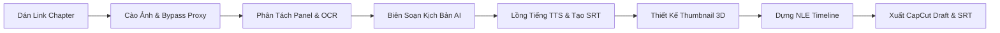

# 🎬 TunaMagaRecap - Manga Studio AI Native OS

<div align="center">


**Hệ sinh thái tự động hóa sản xuất Video Tóm Tắt Truyện Tranh (Manga/Manhwa/Manhua Recap) chuẩn YouTube & TikTok triệu view chỉ với 1-Click.**

[Tính Năng](#-tính-năng-nổi-bật) • [Cài Đặt](#-hướng-dẫn-cài-đặt--khởi-chạy) • [Quy Trình Hoạt Động](#-quy-trình-sản-xuất-video-tự-động) • [Xuất Dữ Liệu](#-các-định-dạng-xuất-dữ-liệu) • [Tech Stack](#-công-nghệ-sử-dụng)

</div>

---

## 🌟 Giới Thiệu Dự Án

**TunaMagaRecap** là một Native Studio AI thế hệ mới được thiết kế chuyên biệt cho các nhà sáng tạo nội dung YouTube Manga Recap và TikTok Review. Chỉ từ một liên kết chapter truyện tranh bất kỳ, hệ thống sẽ tự động hóa toàn bộ các bước từ cào ảnh, phân tách khung tranh (Panel Splitting), nhận diện bóng thoại (OCR), viết kịch bản giật gân, tổng hợp giọng đọc lồng tiếng (Voice TTS), sinh phụ đề (SRT / Dynamic Captions), thiết kế Thumbnail 3D Full HD, cho đến xuất dự án hoàn chỉnh sang **CapCut Draft (.json)**.

---

## ⚡ Tính Năng Nổi Bật

### 1. 🚀 1-Click Full Automation Pipeline
- **Tự động hóa 100%**: Dán link chapter (ThuVienSach, MangaDex, NetTruyen, AsuraScans...) và bấm nút chạy.
- Hệ thống tuần tự xử lý 6 bước tiêu chuẩn: **Cào ảnh ➔ Bỏ chặn CDN ➔ OCR Panel ➔ Biên kịch AI ➔ Lồng tiếng & Phụ đề ➔ Dựng Timeline & Thumbnail 3D**.

### 2. 🖼️ Image Scraper & Anti-Hotlink Proxy Engine
- Thu thập toàn bộ 50 - 100+ trang truyện với độ phân giải cao gốc.
- Tích hợp **Streaming Image Proxy** vượt qua 100% lỗi `403 Forbidden` và cơ chế chống hotlink / kiểm tra Referer từ các server lưu trữ ảnh manga.

### 3. 🔍 Smart Panel Splitting & Multi-Language OCR
- Phân tích cấu trúc trang webtoon/manga thành từng khung hình riêng biệt kèm toạ độ Bounding Box (`bbox`).
- Tự động gợi ý chuyển động máy quay (Camera Motion FX: `zoom_in`, `pan_down`, `dramatic_zoom`, `shake`, `flash`).
- Bóc tách lời thoại nhân vật và làm sạch tạp âm ký tự tự động.

### 4. 🎭 AI Script Director (Kịch Bản Triệu View)
- **100% Panel Coverage**: Thuyết minh liên tục không ngắt quãng cho từng khung tranh, kể cả các khung hình hành động không có thoại thoại OCR.
- **8 Chế độ biên kịch linh hoạt**:
  - `Review Chi Tiết`: Phân tích sâu, đào sâu diễn biến và logic sức mạnh.
  - `Tóm Tắt Nhanh`: Tiết tấu nhanh, xúc tích, cô đọng nội dung chính.
  - `Hài Hước Bựa`: Bình luận châm biếm, meme vui nhộn, bắt trend giới trẻ.
  - `Kinh Dị U Ám`: Xây dựng không khí hồi hộp, rùng rợn và bí ẩn.
  - `Cảm Động Cao Trào`: Đẩy mạnh cảm xúc, bi tráng, nhấn mạnh tình bạn/hy sinh.
  - `Kể Chuyện Nhập Vai`: Dẫn dắt ngôi thứ nhất chân thực như nhân vật trong truyện.
  - `Viết Lại Kịch Bản`: Sáng tạo các nhánh diễn biến bất ngờ (What-if scenario).
  - `YouTube Friendly`: Biên tập an toàn từ ngữ, chống quét vi phạm bản quyền hoặc hạn chế độ tuổi.
- Tích hợp thuật ngữ đặc trưng theo từng thể loại: *Solo Hunter / Hệ Thống, Tu Tiên Long Hồn, Isekai Ma Pháp, Trùng Sinh Báo Thù, Bạo Lực Học Đường*.

### 5. 🔊 High-Fidelity Voice Synthesis (TTS)
- Lồng tiếng tiếng Việt tự nhiên, chuẩn phát âm, không chứa tiếng bíp/chime kỹ thuật.
- Cơ chế bảo vệ **V8 Garbage Collection & Resume Lock** loại bỏ hoàn toàn lỗi ngắt quãng hoặc nhảy về giọng máy mặc định khi chuyển panel.
- Tùy chỉnh âm lượng (0 - 100%), ngắt tiếng tức thì (Instant Mute) và chọn lọc diễn viên lồng tiếng đa dạng.

### 6. 📝 Smart SRT Subtitle Generator & TikTok Styles
- **Xuất file `.srt` chuẩn quốc tế**: Tự động đặt tên theo cấu trúc `[TênTruyện]-Chap[N].srt` ăn khớp 100% với từng khung hình video.
- **4 Kiểu phụ đề hiện đại**:
  - `TikTok Yellow Glow`: Chữ vàng neon nổi bật, viền đen dày chuyên dụng video ngắn.
  - `Anime Neon`: Phát sáng viền màu cyan/hồng phong cách hoạt hình.
  - `Bold Impact`: Chữ in hoa mạnh mẽ, độ tương phản cực cao.
  - `Clean Standard`: Phong cách phụ đề tối giản chuẩn YouTube CC.

### 7. 🎨 AI Thumbnail Studio (3D CTR Booster)
- **8 Phong cách Manga Preset**:
  - ⚡ *Solo Awakening (Hunter & Sét Xanh Neon)*
  - 👑 *Dark Monarch (Hắc Ám & Lửa Đen Vong Linh)*
  - 🐉 *Tu Tiên (Hoàng Kim Long Hồn & Lửa Thần)*
  - 🔮 *Isekai Overlord (Ma Pháp Trận Đa Tầng)*
  - 🩸 *Cuồng Nộ Báo Thù (Huyết Nguyệt & Trảm Kích)*
  - 🚀 *Shonen Action (Tia Tốc Độ Zoom Cam Rực)*
  - 🤖 *Cyber Hacker (Giao Diện HUD Game VR)*
  - 🎨 *Tùy Chỉnh Toàn Diện*
- **Ghép đa tầng ảnh & Vector AI FX**: Chèn ảnh nhân vật chính, lớp bóng quái vật AI phụ, hào quang sét xanh, ma pháp trận, cửa sổ hệ thống SSS-Rank.
- **Typography 3D viền đen dày**: Đầy đủ hiệu ứng gradient kim loại, góc nghiêng giật gân và sticker triệu view (`🔥 SSS-RANK`, `👑 TRÙM CUỐI`, `💎 FULL 4K 60FPS`).
- **Xuất ảnh Canvas 2D độ phân giải cao**: Xuất file `.png` sắc nét tỉ lệ **16:9 YouTube (1920x1080)** và **9:16 TikTok (1080x1920)**.

### 8. 🎞️ 5-Track NLE Timeline & CapCut Export
- Dựng phim đa kênh: Track Ảnh/Chuyển Động, Track Voice Thuyết Minh, Track Phụ Đề, Track Nhạc Nền (BGM), Track Hiệu Ứng (VFX).
- Xuất dự án **CapCut Draft JSON 1-Click** để mở và biên tập tiếp ngay trong CapCut PC/Mobile.
- Tự động sinh bộ **YouTube SEO Metadata** (Tiêu đề thay thế, Mô tả chuẩn SEO, Timecodes mục lục, Tags, Hashtags, Pinned Comment, TikTok Caption).

---

## 📁 Cấu Trúc Thư Mục Dự Án

```
TunaRecap/
├── public/                 # Static assets & sample audio
├── server/                 # Backend proxy & scraper server
│   └── src/
│       ├── index.js        # Express REST API & Proxy Router
│       ├── ocr/            # AI Vision Engine & Story Knowledge
│       └── scraper/        # Manga chapter crawler engines
├── src/                    # Frontend React & TypeScript
│   ├── assets/             # Vector icons & sample graphics
│   ├── components/
│   │   ├── compilation/    # Multi-chapter compiler & merger
│   │   ├── dashboard/      # System statistics & quick actions
│   │   ├── export/         # CapCut & SRT export center
│   │   ├── layout/         # Header, Navigation & Sidebar
│   │   ├── library/        # Manga series & chapter loader
│   │   ├── ocr/            # Panel splitter & BBox visualizer
│   │   ├── queue/          # Batch task processing queue
│   │   ├── script/         # AI Script Director workspace
│   │   ├── thumbnail/      # 3D AI Thumbnail Studio (Canvas 2D)
│   │   ├── timeline/       # 5-Track NLE Video Editor & Player
│   │   └── voice/          # Voice TTS actor selection & mixer
│   ├── store/
│   │   └── useStudioStore.ts # Central Zustand state management
│   ├── types/
│   │   └── studio.ts       # Type definitions & data interfaces
│   └── utils/
│       ├── audioSynthesizer.ts   # Web Speech TTS engine
│       ├── capcutExporter.ts     # CapCut Draft JSON builder
│       ├── constants.ts          # API constants & proxy helpers
│       ├── srtExporter.ts        # SRT Subtitle builder & parser
│       ├── textHelpers.ts        # Text cleaner & formatting
│       ├── thumbnailExporter.ts  # Canvas 1920x1080 PNG renderer
│       └── thumbnailPresets.ts   # Manga themes & AI vector assets
├── package.json
├── tsconfig.json
├── vite.config.ts
└── README.md
```

---

## 🚀 Hướng Dẫn Cài Đặt & Khởi Chạy

### 1. Yêu Cầu Tiên Quyết
- [Node.js](https://nodejs.org/) (Phiên bản **v18.0.0** trở lên)
- Trình duyệt web hiện đại (Google Chrome / Microsoft Edge khuyên dùng để có hỗ trợ Speech Synthesis tốt nhất)

### 2. Cài Đặt Thư Viện

```bash
# Clone dự án từ GitHub
git clone https://github.com/Tunaanhgamedev/TunaMagaRecap.git
cd TunaRecap

# Cài đặt toàn bộ dependencies
npm install
```

### 3. Khởi Chạy Ứng Dụng

Mở **2 cửa sổ Terminal** riêng biệt để chạy Backend và Frontend:

#### 🔹 Terminal 1: Chạy Backend Proxy Server (Port 3001)
```bash
npm run server
```
> Server sẽ lắng nghe tại: `http://localhost:3001` (xử lý cào dữ liệu, proxy hình ảnh và OCR).

#### 🔹 Terminal 2: Chạy Frontend Studio (Port 5173)
```bash
npm run dev
```
> Ứng dụng web sẽ mở tại: `http://localhost:5173/`

---

## 📖 Quy Trình Sản Xuất Video Tự Động



1. **Bước 1 (Thư Viện)**: Dán link chapter truyện vào ô nhập liệu (hoặc bấm chọn nút mẫu nhanh như *Solo Leveling Chap 1*). Bấm **"⚡ 1-Click Tự Động Tạo Video"**.
2. **Bước 2 (Kịch Bản)**: Xem kịch bản recap phân tích chi tiết từng panel. Có thể đổi qua 8 chế độ khác nhau bất kỳ lúc nào.
3. **Bước 3 (Lồng Tiếng & Phụ Đề)**: Chọn giọng đọc tiếng Việt yêu thích, tinh chỉnh tốc độ và xuất file `.srt` chuẩn tên truyện.
4. **Bước 4 (Thumbnail)**: Chọn phong cách bìa ngầu (Solo Awakening, Dark Monarch, Tu Tiên...), chèn thêm quái vật/hào quang AI và bấm **"Tải Xuất Full HD (PNG)"**.
5. **Bước 5 (Timeline & Xuất File)**: Xem trước toàn bộ video trên player, sau đó bấm **"Xuất Dự Án CapCut"** để hoàn thiện video.

---

## 📦 Các Định Dạng Xuất Dữ Liệu

| Định Dạng | Tên File Mặc Định | Ứng Dụng Sử Dụng |
|---|---|---|
| **CapCut Draft JSON** | `CapCut-Draft-[Series]-Chap[N].json` | Import trực tiếp vào CapCut PC/Mac/Mobile |
| **SRT Subtitle File** | `[Series]-Chap[N].srt` | Ghép phụ đề vào Premiere, CapCut, DaVinci Resolve |
| **Thumbnail 16:9 Full HD** | `Thumbnail-[Series]-Chap[N]-16x9-YouTube.png` | Ảnh bìa đại diện YouTube (1920x1080) |
| **Thumbnail 9:16 TikTok** | `Thumbnail-[Series]-Chap[N]-9x16-TikTok.png` | Ảnh bìa đại diện TikTok / Reels (1080x1920) |
| **SEO Metadata** | Copy trực tiếp từ giao diện | Dán vào tiêu đề, mô tả và bình luận ghim YouTube |

---

## 🛠️ Công Nghệ Sử Dụng

- **Frontend Core**: React 19, TypeScript, Vite, Zustand với `persist` middleware lưu trữ dữ liệu offline.
- **Giao Diện & Hiệu Ứng**: Tailwind CSS, Lucide React Icons, HTML5 Canvas 2D API.
- **Xử Lý Âm Thanh & Giọng Đọc**: Web Speech Synthesis API với Voice Resolver & Cache Engine.
- **Backend & Crawler**: Node.js, Express.js, WHATWG Streaming Fetch, HTML Parsing & Image Proxy.
- **Quy Chuẩn Xuất File**: CapCut Project Draft Spec (v3/v4), SubRip Text (SRT) Parser/Builder.

---

## 🤝 Đóng Góp & Phát Triển

Mọi đóng góp nhằm hoàn thiện TunaMagaRecap đều được chào đón nồng nhiệt!
- Báo cáo lỗi (Issues): Tạo issue mô tả chi tiết kèm link truyện kiểm tra.
- Đề xuất tính năng (Pull Requests): Tạo nhánh tính năng mới và gửi PR.

---

<div align="center">
  <sub>Phát triển với ❤️ bởi <strong>Tuna Team</strong> dành cho cộng đồng Manga & Anime Creators.</sub>
</div>
